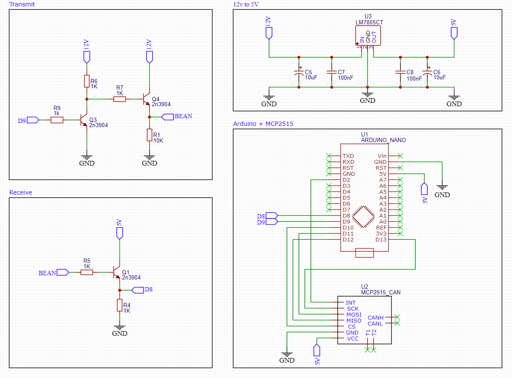
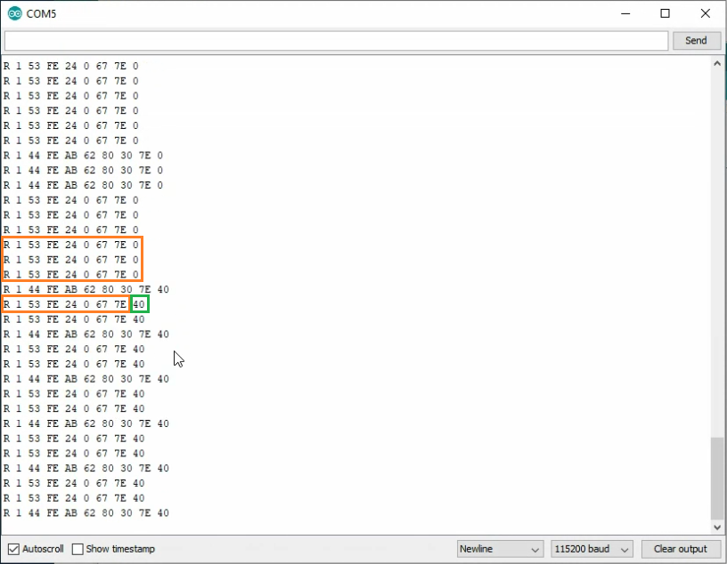

BeanMPX
=======

Bean muliplex is a communication protocol developed by Toyota for body control system in passenger cars. Its a single wire 12 volt serial communication. As bean multiplex isn't very common i created bean multiplex interpreter using an Arduino.

> Why do this?

The ecu is responsible to feed information to the combination meter, if say the ecu was replaced for an aftermarket unit the temperature gauge will not work.

#### Demo: https://youtu.be/FXD5fauDTvY

## Circuit

Here is an example circuits to use for transmit/receive, the MCP2515 module integration can be ignored



## Code

To begin work with BeanMPX, download the ZIP file and include it into the Arduino IDE. 
Next open the example sketch provided. 


### Init
There is one optional parameter which can be set, its the Acknowledge Messages.
BeanMPX can send acknowledge response to messages with a particular destination id. 

```C++
  bean.ackMsg((const uint8_t[]) {0xFE}); // Messages to acknowledge
```
Bean Multiplex repeated the message 3 times if no acknowledgement was received 


### Receive
Receive message is configured similar to arduino SoftwareSerial implemenatition.

### Transmit
Sending message, requires Destination id, Message id, and Data. Priority, Message length, CRC, and End of Message bytes will be generated.

```C++
  bean.sendMsg(engTemp, sizeof(engTemp));
```


